# FINAL PROJECT REPORT

## 1. Identitas

**Nama:** Bagas Humanabiyu
**NIM:** A11.2023.15392
**Kelas:** A11.4602

---

## 2. Deskripsi Project

Simple LMS Extended Backend merupakan sistem backend Learning Management System (LMS) yang dikembangkan menggunakan Django dan Django Ninja API. Sistem ini mendukung pengelolaan course, lesson, enrollment, progress pembelajaran, autentikasi JWT, caching menggunakan Redis, analytics menggunakan MongoDB, serta asynchronous processing menggunakan Celery dan RabbitMQ.

Project ini dikembangkan sebagai implementasi materi Pemrograman Sisi Server dengan mengintegrasikan berbagai teknologi backend modern ke dalam satu sistem yang berjalan menggunakan Docker Compose.

---

## 3. Fitur Dasar yang Sudah Berjalan

| No | Fitur Dasar                              | Status  |
| -- | ---------------------------------------- | ------- |
| 1  | Authentication JWT                       | Selesai |
| 2  | Custom User (Admin, Instructor, Student) | Selesai |
| 3  | Course API                               | Selesai |
| 4  | Lesson API                               | Selesai |
| 5  | Enrollment API                           | Selesai |
| 6  | Progress Tracking                        | Selesai |
| 7  | PostgreSQL Database                      | Selesai |
| 8  | Swagger Documentation                    | Selesai |
| 9  | Docker Compose                           | Selesai |

---

## 4. Fitur Tambahan yang Dipilih

| No | Fitur                        | Kategori                           | Poin | Status  |
| -- | ---------------------------- | ---------------------------------- | ---- | ------- |
| 1  | Redis Course Cache           | Redis, Caching, Performance        | 12   | Selesai |
| 2  | Redis Rate Limiting          | Redis, Caching, Performance        | 12   | Selesai |
| 3  | Cache Invalidation           | Redis, Caching, Performance        | 12   | Selesai |
| 4  | Activity Logging MongoDB     | MongoDB dan Analytics              | 15   | Selesai |
| 5  | Course Statistics Analytics  | MongoDB dan Analytics              | 15   | Selesai |
| 6  | Async Enrollment Email       | Celery, RabbitMQ, Async Processing | 12   | Selesai |
| 7  | Async Certificate Generation | Celery, RabbitMQ, Async Processing | 18   | Selesai |
| 8  | Async CSV Report Export      | Celery, RabbitMQ, Async Processing | 18   | Selesai |
| 9  | Celery Beat Scheduled Task   | Celery, RabbitMQ, Async Processing | 15   | Selesai |
| 10 | Task Status Monitoring       | Celery, RabbitMQ, Async Processing | 12   | Selesai |
| 11 | Flower Monitoring Dashboard  | Celery, RabbitMQ, Async Processing | 8    | Selesai |

---

## 5. Penjelasan Implementasi

### Redis Caching

Redis digunakan untuk menyimpan hasil query course list dan course detail sehingga request berikutnya dapat dilayani langsung dari cache tanpa melakukan query ulang ke PostgreSQL.

Endpoint yang menggunakan Redis:

* GET /api/courses
* GET /api/courses/{course_id}

Selain caching, Redis juga digunakan untuk implementasi rate limiting berdasarkan alamat IP pengguna.

### MongoDB Activity Logging

MongoDB digunakan untuk menyimpan log aktivitas pengguna seperti melihat course, melakukan enrollment, membuat course, dan menjalankan report.

Endpoint:

* GET /api/activity-logs

### MongoDB Analytics

MongoDB digunakan untuk menyimpan statistik course seperti jumlah enrollment pada setiap course.

Endpoint:

* GET /api/reports/course-statistics

### Celery dan RabbitMQ

Celery digunakan untuk menjalankan proses asynchronous, sedangkan RabbitMQ digunakan sebagai message broker.

Task yang diimplementasikan:

* Pengiriman email enrollment
* Pembuatan certificate
* Export report CSV
* Update course statistics

Endpoint:

* POST /api/reports/courses/export
* POST /api/tasks/update-course-statistics
* GET /api/tasks/{task_id}/status

### Progress Tracking

Student dapat menandai lesson yang telah selesai dan melihat progres pembelajaran yang telah dicapai.

Endpoint:

* POST /api/progress/complete
* GET /api/my-progress

---

## 6. Cara Menjalankan Project

Clone repository:

```bash
git clone (LINK REPO)
cd simple-lms
```

Menjalankan seluruh service:

```bash
docker compose up -d
```

Menjalankan migration:

```bash
docker exec -it lms_web python manage.py migrate
```

Akses Swagger:

```text
http://127.0.0.1:8000/api/docs
```

Akses Flower:

```text
http://127.0.0.1:5555
```

---

## 7. Akun Demo

| Role       | Username    | Password      |
| ---------- | ----------- | ------------- |
| Admin      | admin       | admin123      |
| Instructor | instructor1 | instructor123 |
| Student    | student1    | student123    |

---

## 8. Endpoint Penting

### Authentication

* POST /api/auth/register
* POST /api/token/pair
* GET /api/auth/me

### Course

* GET /api/courses
* POST /api/courses
* GET /api/courses/{course_id}
* GET /api/courses/{course_id}/lessons

### Enrollment

* POST /api/enrollments/{course_id}
* GET /api/my-enrollments
* POST /api/enrollments/{enrollment_id}/complete

### Progress

* POST /api/progress/complete
* GET /api/my-progress

### Analytics

* GET /api/activity-logs
* GET /api/reports/course-statistics

### Async Processing

* POST /api/tasks/update-course-statistics
* POST /api/reports/courses/export
* GET /api/tasks/{task_id}/status

---

## 9. Screenshot / Bukti Pengujian

### Screenshot 1 - Swagger Documentation

Pengujian dokumentasi API yang dihasilkan secara otomatis oleh Django Ninja. Dokumentasi ini menampilkan seluruh endpoint yang tersedia pada sistem, termasuk Authentication, Courses, Enrollments, Progress, Analytics, dan Tasks.

Screenshot:

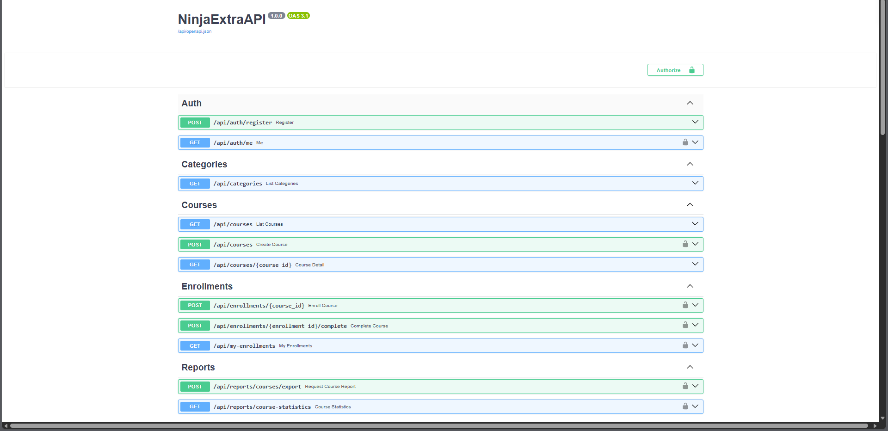

---

### Screenshot 2 - JWT Authentication

Pengujian autentikasi menggunakan JWT Token melalui endpoint login. Sistem berhasil menghasilkan access token dan refresh token yang digunakan untuk mengakses endpoint yang memerlukan autentikasi.

Endpoint:

```http
POST /api/token/pair
```

Screenshot:

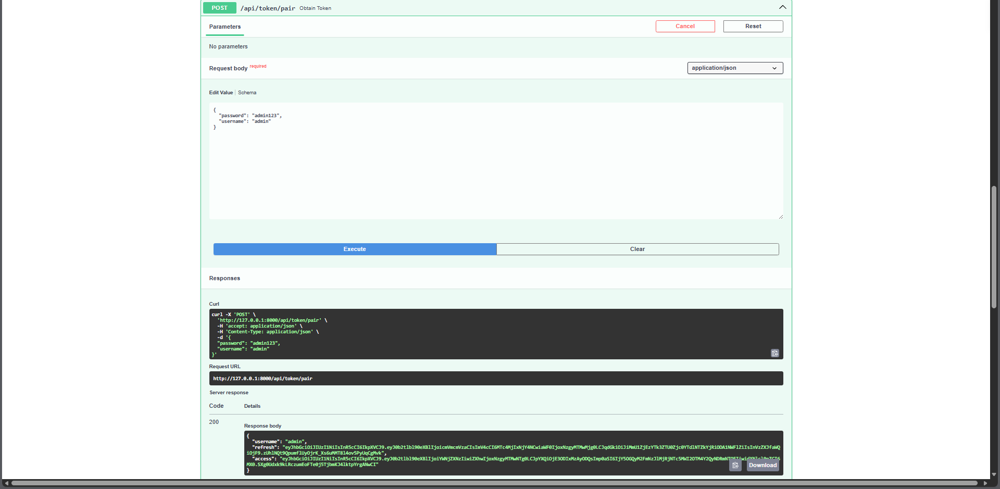

---

### Screenshot 3 - Course List API

Pengujian endpoint untuk menampilkan daftar course yang tersedia pada sistem. Data berhasil diambil dari database PostgreSQL dan ditampilkan dalam format JSON.

Endpoint:

```http
GET /api/courses
```

Screenshot:

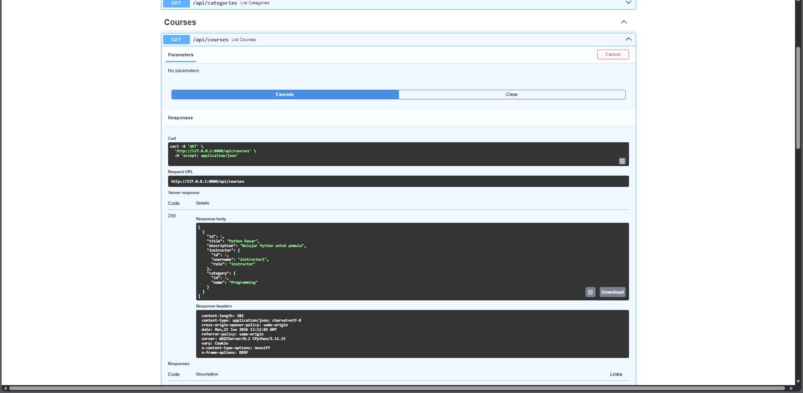

---

### Screenshot 4 - Redis Cache

Pengujian implementasi Redis sebagai cache untuk data course. Setelah endpoint course dipanggil, data berhasil disimpan ke Redis sehingga request berikutnya dapat dilayani tanpa melakukan query ulang ke database.

Perintah pengujian:

```bash
docker exec -it lms_redis redis-cli
SELECT 1
KEYS *
```

Screenshot:

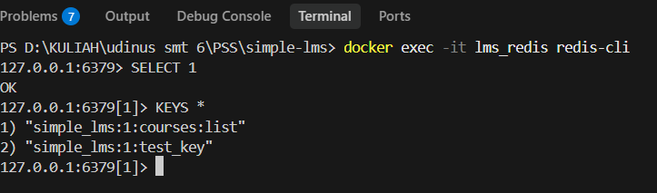

---

### Screenshot 5 - Activity Logs MongoDB

Pengujian penyimpanan activity log pada MongoDB. Sistem berhasil mencatat aktivitas pengguna seperti melihat course, melakukan enrollment, dan proses lainnya.

Endpoint:

```http
GET /api/activity-logs
```

Screenshot:

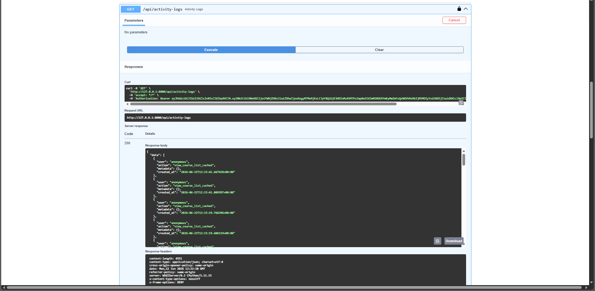

---

### Screenshot 6 - Course Statistics Analytics

Pengujian fitur analytics yang menyimpan statistik course ke MongoDB. Sistem berhasil menampilkan jumlah enrollment pada setiap course yang tersedia.

Endpoint:

```http
GET /api/reports/course-statistics
```

Screenshot:

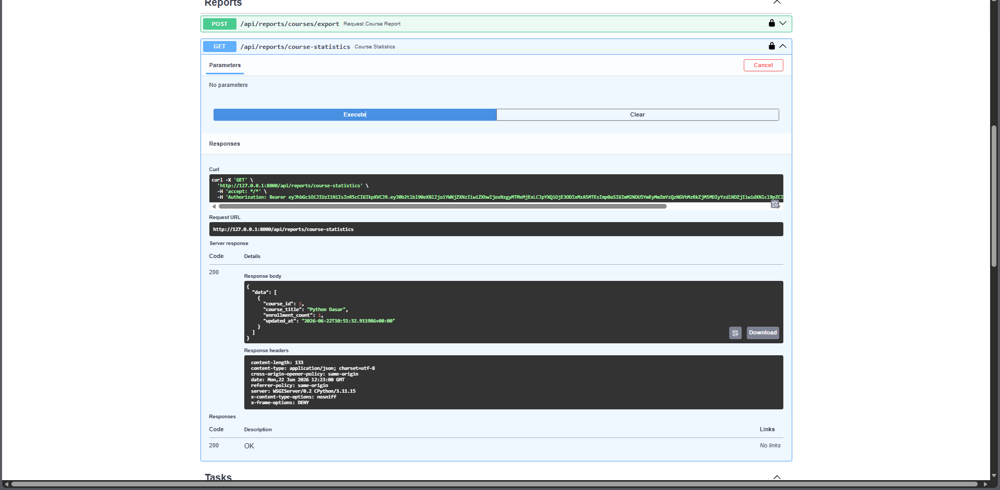

---

### Screenshot 7 - Celery Task Status

Pengujian task asynchronous menggunakan Celery. Task berhasil dieksekusi dan menghasilkan status SUCCESS yang menandakan proses berjalan dengan baik.

Endpoint:

```http
GET /api/tasks/{task_id}/status
```

Screenshot:

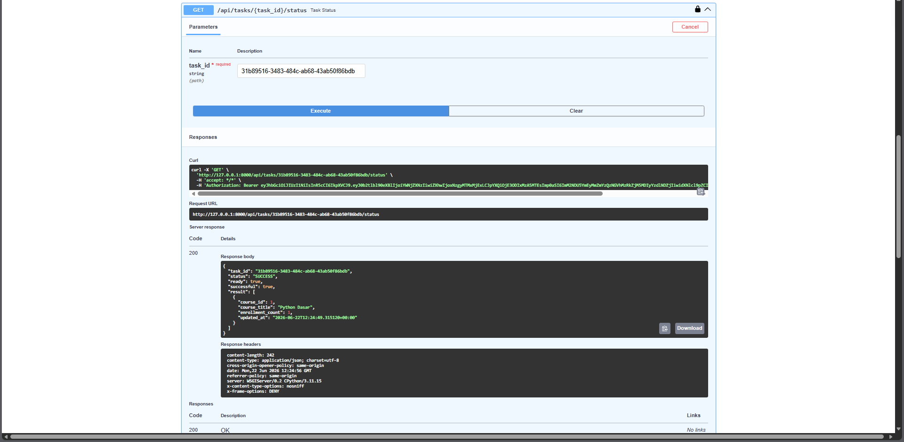

---

### Screenshot 8 - Generated Certificate

Pengujian pembuatan certificate secara asynchronous setelah student menyelesaikan course. Sistem berhasil menghasilkan file certificate secara otomatis.

Perintah verifikasi:

```bash
cat generated/certificates/certificate_enrollment_2.txt
```

Screenshot:

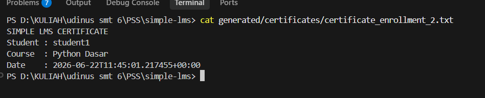

---

### Screenshot 9 - Generated CSV Report

Pengujian export laporan course ke dalam format CSV menggunakan Celery Task. Sistem berhasil membuat file report yang berisi data course dan jumlah enrollment.

Perintah verifikasi:

```bash
cat generated/reports/course_report_1782128832.csv
```

Screenshot:

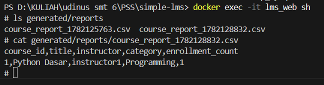

---

### Screenshot 10 - Flower Dashboard

Pengujian monitoring Celery menggunakan Flower. Dashboard berhasil menampilkan worker yang aktif dan terhubung dengan RabbitMQ sehingga proses asynchronous dapat dimonitor secara real-time.

URL:

```text
http://127.0.0.1:5555
```

Screenshot:

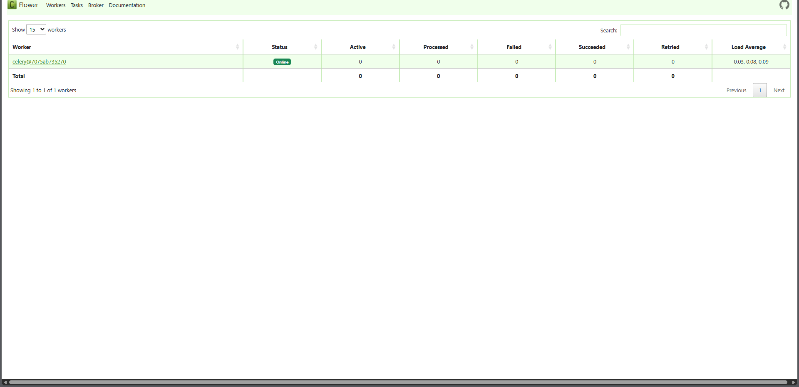

---

### Screenshot 11 - Docker Containers

Pengujian seluruh service yang dijalankan menggunakan Docker Compose. Seluruh container berhasil berjalan dengan status aktif, meliputi Django Web, PostgreSQL, Redis, MongoDB, RabbitMQ, Celery Worker, Celery Beat, dan Flower.

Perintah:

```bash
docker ps
```

Screenshot:

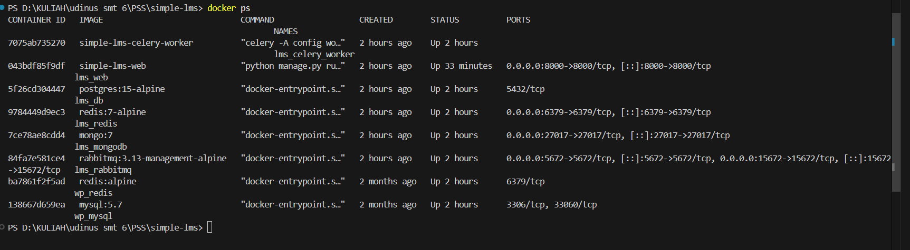

---

## 10. Kendala dan Solusi

| Kendala                                            | Solusi                                            |
| -------------------------------------------------- | ------------------------------------------------- |
| Port 8000 bentrok dengan container WordPress       | Menghentikan container WordPress sementara        |
| Celery task berstatus PENDING                      | Menjalankan Celery Worker                         |
| JWT token expired saat pengujian                   | Login ulang dan melakukan authorize kembali       |
| Duplicate username menyebabkan error saat register | Menambahkan validasi username dan email           |
| Certificate gagal dibuat saat login sebagai admin  | Menggunakan akun student yang memiliki enrollment |

---

## 11. Kesimpulan

Pada final project ini berhasil diimplementasikan berbagai konsep Pemrograman Sisi Server seperti REST API, JWT Authentication, PostgreSQL, Redis Caching, MongoDB Analytics, RabbitMQ, Celery Asynchronous Processing, Flower Monitoring, dan Docker Compose.

Melalui project ini diperoleh pemahaman mengenai pengembangan backend modern yang tidak hanya berfokus pada penyimpanan data, tetapi juga optimasi performa, monitoring, analytics, dan pemrosesan asynchronous untuk meningkatkan skalabilitas sistem.
