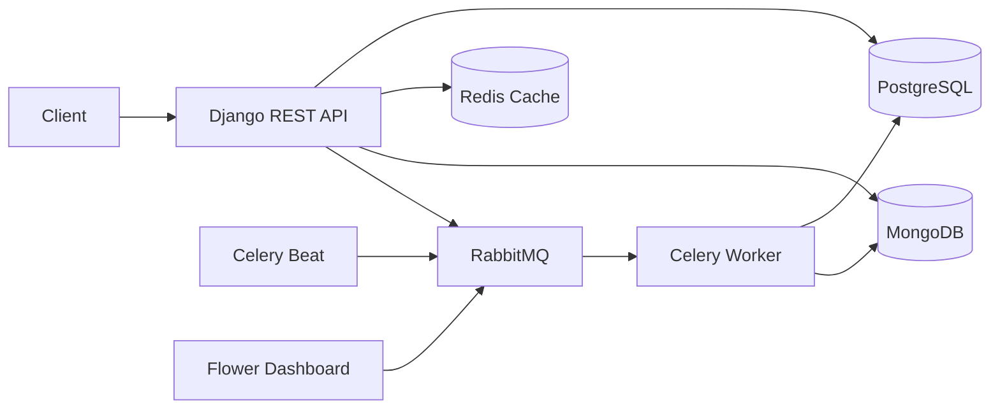

# Simple LMS - Progress 4

Progress 4 merupakan pengembangan lanjutan dari aplikasi **Simple Learning Management System (LMS)** pada mata kuliah **Pemrograman Server**. Pada tahap ini sistem tidak hanya menangani proses pembelajaran, tetapi juga mengimplementasikan teknologi pendukung untuk meningkatkan performa, skalabilitas, dan monitoring aplikasi.

## 🚀 Teknologi yang Diimplementasikan

### 🔹 Redis

Redis dimanfaatkan sebagai media **in-memory caching** agar proses pengambilan data menjadi lebih cepat.

Fitur yang menggunakan Redis antara lain:

* Menyimpan cache daftar course.
* Menyimpan cache detail course.
* Menghapus cache secara otomatis ketika instructor menambahkan course baru.
* Menerapkan pembatasan akses (*rate limiting*) sebesar **60 request per menit** untuk setiap alamat IP.

---

### 🔹 MongoDB

MongoDB digunakan sebagai database NoSQL untuk menyimpan data yang bersifat log dan analitik.

Data yang disimpan meliputi:

* Riwayat aktivitas pengguna (`activity_logs`).
* Data analitik pembelajaran (`learning_analytics`).
* Rekapitulasi statistik course menggunakan **MongoDB Aggregation Pipeline**.

---

### 🔹 Celery

Celery berperan sebagai sistem **asynchronous task queue**, sehingga proses yang memerlukan waktu cukup lama dapat dijalankan di background tanpa menghambat respons aplikasi.

Task yang tersedia meliputi:

* Mengirim email konfirmasi enrollment.
* Membuat sertifikat peserta.
* Memperbarui statistik course.
* Mengekspor laporan course.

---

### 🔹 RabbitMQ

RabbitMQ digunakan sebagai **message broker** yang menghubungkan aplikasi Django dengan Celery Worker untuk mendistribusikan task secara asynchronous.

---

### 🔹 Flower

Flower digunakan sebagai dashboard monitoring Celery untuk melihat:

* Status task secara real-time.
* Task yang berhasil maupun gagal.
* Daftar worker yang sedang aktif.
* Statistik eksekusi task.

---

# Arsitektur Sistem

## Ringkasan Alur Sistem

1. Pengguna mengirimkan request ke **Django API**.
2. Data utama diproses menggunakan **PostgreSQL**.
3. Redis mempercepat akses data melalui mekanisme caching.
4. Aktivitas pengguna serta data analitik disimpan pada **MongoDB**.
5. Proses yang membutuhkan waktu lebih lama dikirim ke **Celery** melalui **RabbitMQ**.
6. Celery Worker mengeksekusi task di background.
7. Seluruh aktivitas task dapat dipantau melalui **Flower**.
