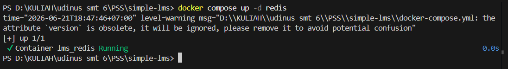
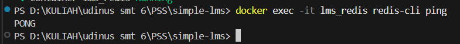
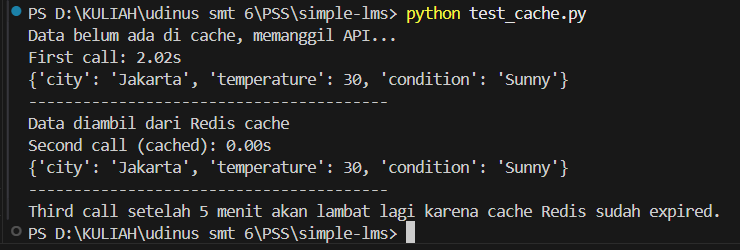

# Redis Caching Exercise

## Tujuan

Implementasi Redis sebagai cache untuk menyimpan hasil API call sehingga dapat mengurangi response time pada request berikutnya.

---

# 1. Konsep Caching

Caching adalah teknik penyimpanan data sementara pada media yang lebih cepat diakses dibandingkan sumber data utama.

Pada tugas ini Redis digunakan sebagai cache layer untuk menyimpan hasil response API cuaca selama 5 menit (300 detik).

Alur kerja:

1. Aplikasi menerima request data cuaca.
2. Sistem memeriksa Redis terlebih dahulu.
3. Jika data tersedia pada cache maka data langsung dikembalikan.
4. Jika data tidak tersedia maka aplikasi melakukan API call.
5. Hasil API call disimpan ke Redis.
6. Data dikembalikan ke pengguna.

---

# 2. Implementasi Redis

## Koneksi Redis

```python
import redis

redis_client = redis.Redis(
    host="localhost",
    port=6379,
    db=0,
    decode_responses=True
)
```

## Implementasi Caching

```python
import time
import json
import redis

redis_client = redis.Redis(
    host="localhost",
    port=6379,
    db=0,
    decode_responses=True
)

def get_weather(city):
    cache_key = f"weather:{city.lower()}"

    cached_data = redis_client.get(cache_key)

    if cached_data:
        print("Data diambil dari Redis cache")
        return json.loads(cached_data)

    print("Data belum ada di cache, memanggil API...")
    time.sleep(2)

    result = {
        "city": city,
        "temperature": 30,
        "condition": "Sunny"
    }

    redis_client.set(cache_key, json.dumps(result))
    redis_client.expire(cache_key, 300)

    return result
```

---

# 3. Testing

Script pengujian:

```python
import time
from weather_api import get_weather

start = time.time()
result1 = get_weather("Jakarta")
time1 = time.time() - start
print(f"First call: {time1:.2f}s")

start = time.time()
result2 = get_weather("Jakarta")
time2 = time.time() - start
print(f"Second call (cached): {time2:.2f}s")
```

---

# 4. Hasil Pengujian

Output terminal:

```text
Data belum ada di cache, memanggil API...
First call: 2.02s
{'city': 'Jakarta', 'temperature': 30, 'condition': 'Sunny'}

----------------------------------------

Data diambil dari Redis cache
Second call (cached): 0.00s
{'city': 'Jakarta', 'temperature': 30, 'condition': 'Sunny'}

----------------------------------------

Third call setelah 5 menit akan lambat lagi karena cache Redis sudah expired.
```

---

# 5. Screenshot Hasil

## Screenshot 1 - Redis Berjalan

Perintah:

```bash
docker compose up -d redis
```

Screenshot:



---

## Screenshot 2 - Redis Ping

Perintah:

```bash
docker exec -it lms_redis redis-cli ping
```

Output:

```text
PONG
```

Screenshot:



---

## Screenshot 3 - Hasil Pengujian Cache

Perintah:

```bash
python test_cache.py
```

Screenshot:



---

# 6. Redis Commands yang Digunakan

## GET

Mengambil data dari Redis.

```redis
GET weather:jakarta
```

## SET

Menyimpan data ke Redis.

```redis
SET weather:jakarta "{...}"
```

## EXPIRE

Menentukan masa berlaku cache.

```redis
EXPIRE weather:jakarta 300
```

## TTL

Melihat sisa waktu cache.

```redis
TTL weather:jakarta
```

---

# 7. Analisis

## Kenapa response time berbeda?

Response pertama membutuhkan waktu sekitar 2 detik karena data belum tersedia di Redis sehingga aplikasi harus melakukan API call terlebih dahulu.

Response kedua jauh lebih cepat karena data sudah tersimpan pada Redis dan dapat langsung diambil dari cache tanpa melakukan API call kembali.

---

## Apa keuntungan caching?

1. Mempercepat response time.
2. Mengurangi beban server.
3. Mengurangi jumlah API call.
4. Menghemat penggunaan resource.
5. Meningkatkan pengalaman pengguna.

---

## Kapan sebaiknya tidak menggunakan cache?

1. Data yang harus selalu real-time.
2. Data yang sangat sering berubah.
3. Data sensitif seperti transaksi keuangan.
4. Informasi yang harus selalu akurat setiap saat.

---

# 8. Kesimpulan

Redis berhasil diimplementasikan sebagai cache layer untuk menyimpan hasil API call.

Pengujian menunjukkan bahwa request pertama membutuhkan waktu sekitar 2 detik, sedangkan request berikutnya dapat diproses hampir secara instan karena data telah tersimpan pada Redis.

Dengan demikian implementasi caching berhasil mengurangi response time dan meningkatkan performa aplikasi.
